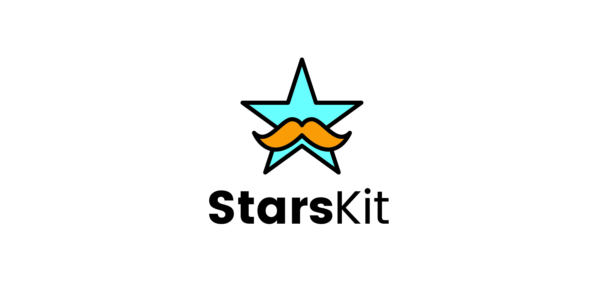

# StarsKit

[](https://travis-ci.org/5018f8cb1e0f36a3fc9dbcfb9b424c62bd36a049/StarsKit)
[](http://cocoapods.org/pods/StarsKit)
[](http://cocoapods.org/pods/StarsKit)
[](http://cocoapods.org/pods/StarsKit)



**Look at this beautiful MouSTARche!**

StarsKit is a lightfull Swift library to simplify and configure your app rating workflow.

It can be based on a remote, local or static configuration data with optionnals properties.

## Requirements

- iOS 9.0+
- Swift 4+
- Xcode 9.2+

## Third parties dependencies

Today we have third parties dependencies, but the purpose is to avoid them the most.

To have a quick available library and significant customization, we use 3 dependencies:

- [Extra/UIKit](https://github.com/smartnsoft/Extra): our library to simplify UIKit operation code
- [Jelly](https://github.com/SebastianBoldt/Jelly): a simple UI component to simplify the rating transition display
- [Cosmos](https://github.com/evgenyneu/Cosmos): a powerful and flexible stars slider UI component

## Description

### Customizable screens
<p align="center">  </p>

The main feature of the library is to **simply use static or dynamic (remote) configuration to show native or custom app rating screen**.

If the user chooses a negative rate, he will be redirected to the **feedback screen**.
If the user chooses a positive rate, he will be redirected to the **Store review sreen**.

You and only you choose what to do when the user choose to give a feedback (mail / other custom screen).
This the same for when the user choose to rate the app: choose to redirect on the review page or anyhting else.

### Native StoreKit screen

You can also display the native `StoreKit` screen:

<p align="center"></p>

### Features list

- [X] Use localizable or configuration strings
- [X] Default localizables strings
- [X] Overridable localizables strings
- [X] Static configuration strings
- [X] Cocoapods integration
- [X] Default & configurable step transitions
- [X] Default display algorithm behavior
- [X] Customizable display algorithm behavior
- [X] Customizable stars style
- [X] Customizable fonts, text & tint colors
- [X] Rating & screen actions callbacks
- [X] Configurable with dictionnary / data or remote URL: everything you want!
- [X] Native iOS 10.3+ StoreKit integration
- [ ] Carthage integration
- [ ] Overridable layouts

## Configurable metrics for display

You can specify metrics to trigger the default display behavior or use your own one.

- [X] Disable / enable the component
- [X] Increment session counter
- [X] Static configuration strings
- [X] Days without crash
- [X] Days before asking again
- [X] Number of reminding
- [X] Maximum of days betwteen session count
- [ ] Email configuration
- [X] Step 1: Rate screen
- [X] Step 2: Feedback screen
- [X] Step 3: Store review screen


## Example

To run the example project, clone the repo, and run `pod install` from the Example directory first.

## Installation

StarsKit is available through [CocoaPods](http://cocoapods.org). To install
it, simply add the following line to your Podfile:

```ruby
pod 'StarsKit'
```

## Usage

### Update the configuration

See also : `StarsKitProperties` enum keys.
You have to conform the data dicitonnary to the expected keys.

**StarsKit offers you the possibility of using any configuration source**: local JSON file, static dictionnary, remote file (remote JSON or Firebase remote configuration file).

To update the configuration, simply give the dictionnary data :

``` swift
let data = try Data(contentsOf: URL(fileURLWithPath: path))
let localJSONConfiguration = try JSONSerialization.jsonObject(with: data, options: .allowFragments) as! [String: Any?]
StarsKit.shared.updateConfig(from: localJSONConfiguration)
```

### Update the metrics with `StarsKitContext`

To trigger the pop-up rating display, you have to update the metrics.

``` swift
// Increment the number of crash, this will automatically update the last crash date (lastCrashDate)
StarsKit.shared.context.nbCrashes += 1

// Increment the session directly
StarsKit.shared.context.nbSessions += 1
// or
StarsKit.shared.incrementSession(by: 10)

// You can also reset all the values
StarsKit.shared.resetContext()
```

### UI customization with `StarsKitGraphicContext`


## Contributors

Jean-Charles Sorin - Smart&Soft

## License

StarsKit is available under the MIT license. See the LICENSE file for more info.
